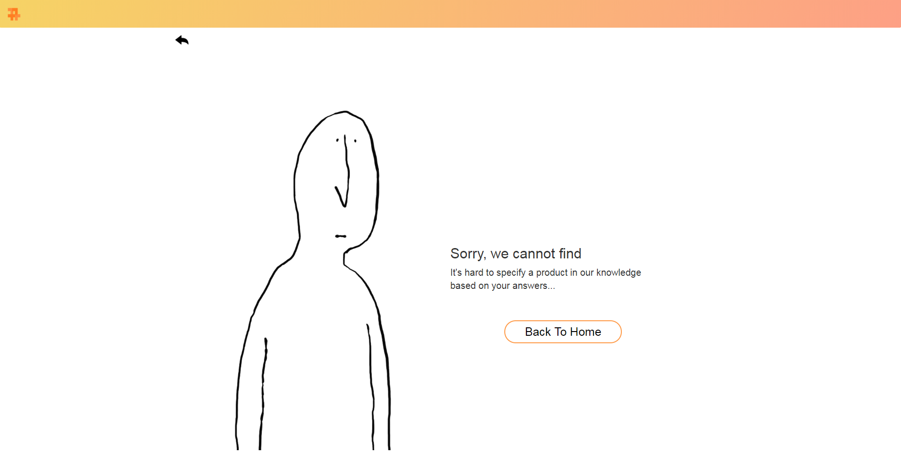

# Project GGYU(뀨)

This project helps people to find home styling product. If you want to find specific type of product but don't know how to call it, this will help you. We will ask some questions related with products. For example, what does it look like or ways of using it. All users have to do is just clicking answers

## **Screenshots**


Main page


Asking questions


Finding result


Failure page

## Library & Frameworks

Bootstrap: [http://bootstrapk.com/](http://bootstrapk.com/)

## How to use

- Go to *[wltjr1002.github.io](http://wltjr1002.github.io)*
- You can start by pressing start button at the bottom
- If you cannot understand question or don't know what the answer is, press 'not sure' or 'don't know' rather than making a random choice.
- If you have answered enough questions, we will suggest you the product. If it is what you thought, press yes. It will redirect you to market website. If it isn't, press no and keep answering.

## Products that you can find

```
펜던트조명
레일조명
벽조명
게이밍의자
토퍼
좌식의자
바디필로우
자바라 행거
마크라메 월행잉
바체어
규조토 발매트
패브릭 포스터
모션베드
빈백
테라리움
이니셜우드
의자발커버
선캐쳐

```

The more products will be added in the future version.

## Files

```
├── images
│     └── ...   // logoes, background images, etc.
├── data
│     ├── product.js   // product database
│     └── questions.js // question database
├── algorithm.js       // product finding algorithm
├── question.js        // question page script
├── result.js          // result page script
├── script.js          // main script
├── style.css          
└── index.html         // main page

```

## **Contribute**

Jiseok Kim ([@wltjr1002](https://github.com/wltjr1002))

Yeongbin Kim ([@ybin77](https://github.com/ybin77))

Taegyu Jin ([@realjin36](https://github.com/realjin36))

Jaeyoung Hwang ([@Akais24](https://github.com/Akais24))
